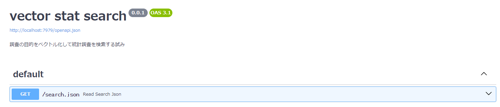

# stat_vector_search

## Overview
- 統計調査の目的をベクトル検索したらよさげかもしれない
- 統計調査の目的は事前に調査計画のPDFからテキストを抽出して正規表現でひっこぬいてます
  - `purpose.csv` がそうです。

## Getting Started
### 1. docker-compose up !!
``` shell
git clone https://github.com/tsutomu-nagano/stat_vector_search.git
cd stat_vector_search
docker-compose up -d
```

>❗⏰ 初回の起動のみ次の処理が実行されるため数分時間がかかります   
> - モデルのダウンロード
> - CSVファイルの調査計画のデータをベクトルに変換


### 2. browser Access
http://localhost:7979/docs/



## Usage
### 1. Set Parameters  
 keyword = 工場の数

### 2. Execute !!
  工業統計 is include 👍
  ``` json
[
  {
    "statcode": "00550350",
    "purpose": "製造工業の先行き２か月の生産見込数量を把握し、景気動向等の判断資料である製造工業生産予測指数を作成するための基礎資料を得ることを目的とする。",
    "statname": "製造工業生産予測指数",
    "similarity": 0.8144864532367466
  },
  {
    "statcode": "00200602",
    "purpose": "企業全体及びその内数として本社事業所における管理活動等に係る投入構造を把握し、産業連関表の部門別の投入額推計等の基礎資料を得ることを目的とする。",
    "statname": "産業連関構造調査（企業の管理活動に関する実態調査）",
    "similarity": 0.8121904320953683
  },
  {
    "statcode": "00550510",
    "purpose": "工場の立地動向を全国にわたり統一した基準で迅速に調査することにより、工場立地の実態を把握し、工場立地の適正化及び土地利用の合理化に役立てるための基礎資料を得ることを目的とする。",
    "statname": "工場立地動向調査",
    "similarity": 0.8103973715271703
  },
  {
    "statcode": "00550010",
    "purpose": "我が国工業の実態を明らかにし、工業に関する施策の基礎資料を得るとともに、経済センサス-活動調査の中間年における経済構造統計を作成することを目的とする。",
    "statname": "工業統計調査",
    "similarity": 0.8059503945718086
  },
  {
    "statcode": "00100401",
    "purpose": "機械製造業者の受注した設備用機械類について実績および見通しを調査し、設備投資状況の先行きを予測し、景気動向を把握するための基礎資料とする。",
    "statname": "機械受注統計調査",
    "similarity": 0.8044786533369782
  }
]
  ```
